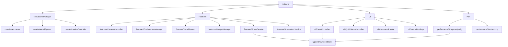

# Module Decomposition & Dependency Graph (Proposed)

## Motivation

`car-showroom-v3.ts` is effective but monolithic. The primary improvement opportunity is **separation of concerns**: Three.js lifecycle vs UI binding vs serialization vs performance.

## Proposed structure

```
src/scripts/car-showroom/
  core/
    SceneManager.ts
    AssetLoader.ts
    MaterialSystem.ts
    AnimationController.ts
  features/
    CameraController.ts
    EnvironmentManager.ts
    DecalSystem.ts
    HotspotManager.ts
    ScreenshotService.ts
    ShareService.ts
  ui/
    PanelController.ts
    QuickMenuController.ts
    CommandPalette.ts
    ControlBindings.ts
    Toast.ts
  performance/
    AdaptiveQuality.ts
    MemoryManager.ts
    RenderLoop.ts
  types/
    ShowroomState.ts
    PresetSchema.ts
    Events.ts
  index.ts
```

## Dependency graph



## Refactor approach (non-breaking)

- Phase 1: Extract pure helpers/types (no behavior changes)
- Phase 2: Extract services with the same public surface as today
- Phase 3: Introduce internal event bus and move side effects behind it
